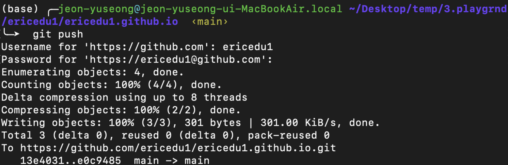

생성일: 2023년 6월 7일 오후 3:35

# 1. github.io Blog building


## 1. What is Github

### 1.1 Git

### 1.2 GitHub

## 2. Working on Github

### 2.1 github를 잘 깔아준다.

### 2.2 git에 파일 올리는 과정

index.html 파일 추가해준다. 이때 index 라는 이름을 사용하는 이유는 메인 페이지를 만드는 웹 상의 규범이기 때문이고, html이라는 확장자의 의미는 크롬과 같은 브라우저가 인식하는 언어로 웹페이지를 구성할 때 사용하는 언어를 html이라 하는데, 이 언어를 사용하기 위함이다.

```html
<html>
<body>Hello, world!</body>
</html>
```

다음과 같은 HTML 문서를 추가해주고 우리는 github에 우리가 쓴 코드가 제대로 올라가는지 확인해야한다. git 레포지토리를 clone해서 local환경으로 가져온다. 쉽게말해서, git의 환경을 현재 자신이 사용하고 있는 환경과 연결을 시켜주는 것이다.

```bash
git clone -https
```

이제 작성된 파일들을 git hub에 올려준다.

```bash
#-A : 모든 파일, 모든 파일을 git에 보내기 전단계에 올려놓는다.
git add -A
#commit : git에 올라가기전 준비를 마친다.
git commit -m “first commit”
#push : git으로 파일을 올린다.
git push
```

### 2.3 error 발생, 대처

github에서 뚝딱거려본게 처음은 아니라 발생하는 문제인듯 하다.

<aside>
💡 remote: Invalid username or password.
fatal: Authentication failed for '[https://github.com/ericedu1/ericedu1.github.io.git/](https://github.com/ericedu1/ericedu1.github.io.git/)'

</aside>

다음과 같은 에러 발생, git config를 수정해주어 변경하자

```bash
## user name config
git config --global user.name "ericedu1"
## user token config
git config --global user.token blabla
```

사실 정확한 매커니즘은 추가로 공부해 봐야 알겠지만 위와 같은 과정을 거치면 아이디, 패스워드 입력창이 다시 나와 시작 가능. 그럼 마지막으로 다음과 같은 화면을 확인하면서 push를 완료할 수 있다.



### 2.4 결과물


위와 같이 결과물이 등록된다. index.html의 내용을 수정해서 웹페이지를 꾸며보자!

## 3. update 230607

23년 6월 7일 업데이트 내용 정리이다.

- anker 태그를 사용해서 다른 페이지로 연결이 가능해짐
- 추가페이지로 github.io Blog building 2장 부분까지 obsidian의 plugin 중 하나인 Webpage HTML export를 사용해 보았다. 나쁘지 않은 디자인, but 반응성이 좋지 못하다, 모바일로 봤을 때 폰트 사이즈 등이 최적화 되지 않음 등의 문제점.

### 3.1 Anker, Button tag
메인 페이지에서 다른 페이지로 이동할 수 있게해주는 버튼의 역할을 한다. 실제로 버튼 태그가 따로 존재하기도한다. 용도에 맞춰서 사용하면 잘 꾸밀 수 있을 것이다. (물론 지금의 메인페이지는 달랑 텍스트와 anker하나만 존재하지만 말이다.) 